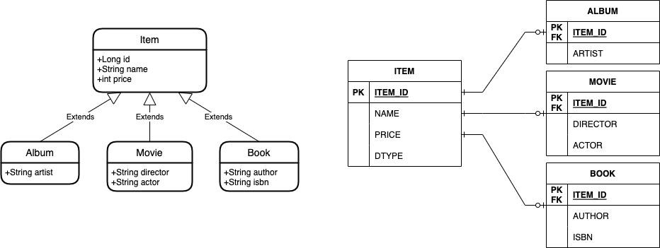

# Hello JPA 11

### 주요 내용

고급 매핑

- 상속관계 매핑 - 조인 전략



```sql
create table Album
(
    artist varchar(255),
    id     bigint not null,
    primary key (id)
);

create table Book
(
    author varchar(255),
    isbn   varchar(255),
    id     bigint not null,
    primary key (id)
);

create table Item
(
    DTYPE varchar(31) not null,
    id    bigint  not null,
    name  varchar(255),
    price integer not null,
    primary key (id)
);

create table Movie
(
    actor    varchar(255),
    director varchar(255),
    id       bigint not null,
    primary key (id)
);

alter table Album
    add constraint FKcve1ph6vw9ihye8rbk26h5jm9
        foreign key (id)
            references Item;

alter table Book
    add constraint FKbwwc3a7ch631uyv1b5o9tvysi
        foreign key (id)
            references Item;

alter table Movie
    add constraint FK5sq6d5agrc34ithpdfs0umo9g
        foreign key (id)
            references Item;
```

```sql
insert into Item (name, price, DTYPE, id)
values (?, ?, 'Movie', ?);

insert into Movie (actor, director, id)
values (?, ?, ?);
```

```sql
select movie0_.id       as id1_2_0_,
       movie0_1_.name   as name2_2_0_,
       movie0_1_.price  as price3_2_0_,
       movie0_.actor    as actor1_3_0_,
       movie0_.director as director2_3_0_
from Movie movie0_
         inner join
     Item movie0_1_ on movie0_.id = movie0_1_.id
where movie0_.id = ?
```