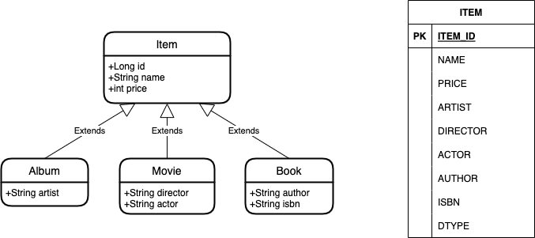

# Hello JPA 12

### 주요 내용

고급 매핑

- 상속관계 매핑 - 단일 테이블 전략



```sql
create table Item
(
    DTYPE    varchar(31) not null,
    id       bigint      not null,
    name     varchar(255),
    price    integer     not null,
    artist   varchar(255),
    author   varchar(255),
    isbn     varchar(255),
    actor    varchar(255),
    director varchar(255),
    primary key (id)
)
```

```sql
insert into Item (name, price, actor, director, DTYPE, id)
values (?, ?, ?, ?, 'Movie', ?)
```

```sql
select movie0_.id       as id2_0_0_,
       movie0_.name     as name3_0_0_,
       movie0_.price    as price4_0_0_,
       movie0_.actor    as actor8_0_0_,
       movie0_.director as director9_0_0_
from Item movie0_
where movie0_.id = ?
  and movie0_.DTYPE = 'Movie'
```