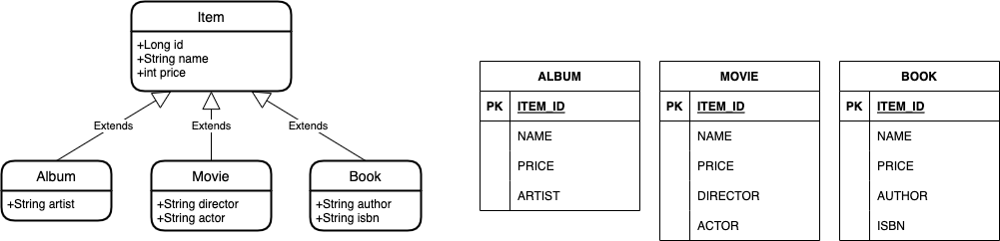

# Hello JPA 13

### 주요 내용

고급 매핑

- 상속관계 매핑 - 구현 클래스마다 테이블 전략



```sql
create table Album
(
    id     bigint  not null,
    name   varchar(255),
    price  integer not null,
    artist varchar(255),
    primary key (id)
)

create table Book
(
    id     bigint  not null,
    name   varchar(255),
    price  integer not null,
    author varchar(255),
    isbn   varchar(255),
    primary key (id)
)

create table Movie
(
    id       bigint  not null,
    name     varchar(255),
    price    integer not null,
    actor    varchar(255),
    director varchar(255),
    primary key (id)
)
```

```sql
insert into Movie (name, price, actor, director, id)
values (?, ?, ?, ?, ?)
```

```sql
select movie0_.id       as id1_2_0_,
       movie0_.name     as name2_2_0_,
       movie0_.price    as price3_2_0_,
       movie0_.actor    as actor1_3_0_,
       movie0_.director as director2_3_0_
from Movie movie0_
where movie0_.id = ?
```

```sql
select item0_.id       as id1_2_0_,
       item0_.name     as name2_2_0_,
       item0_.price    as price3_2_0_,
       item0_.artist   as artist1_0_0_,
       item0_.author   as author1_1_0_,
       item0_.isbn     as isbn2_1_0_,
       item0_.actor    as actor1_3_0_,
       item0_.director as director2_3_0_,
       item0_.clazz_   as clazz_0_
from (select id,
             name,
             price,
             artist,
             null as author,
             null as isbn,
             null as actor,
             null as director,
             1    as clazz_
      from Album
      union
          all
      select id,
             name,
             price,
             null as artist,
             author,
             isbn,
             null as actor,
             null as director,
             2    as clazz_
      from Book
      union
          all
      select id,
             name,
             price,
             null as artist,
             null as author,
             null as isbn,
             actor,
             director,
             3    as clazz_
      from Movie
     ) item0_
where item0_.id = ?
```